# Refactoring Roadmap: StudentsPage.jsx

## Current State Analysis

**File:** [`StudentsPage.jsx`](src/pages/master/StudentsPage.jsx)  
**Current Lines:** 5,548  
**Target:** ~4,000 lines (reduce ~1,500+ lines)  
**Principle:** Move code only — no logic changes

### Already Extracted Components

| Component | File | Status |
|-----------|------|--------|
| [`StudentFormModal`](src/components/students/StudentFormModal.jsx) | StudentFormModal.jsx | ✅ Done |
| [`StudentRow`](src/components/students/StudentRow.jsx) / [`StudentMobileCard`](src/components/students/StudentRow.jsx) | StudentRow.jsx | ✅ Done |
| [`StudentPrintModal`](src/components/students/StudentPrintModal.jsx) | StudentPrintModal.jsx | ✅ Done |
| [`StudentProfileModal`](src/components/students/StudentProfileModal.jsx) | StudentProfileModal.jsx | ✅ Done |
| [`StudentExportModal`](src/components/students/StudentExportModal.jsx) | StudentExportModal.jsx | ✅ Done |
| [`StudentImportModal`](src/components/students/StudentImportModal.jsx) | StudentImportModal.jsx | ✅ Done |
| [`StudentsHeader`](src/components/students/StudentsHeader.jsx) | StudentsHeader.jsx | ✅ Done (but NOT used — header is still inline in page) |
| [`RaportBulananModal`](src/components/students/RaportBulananModal.jsx) | RaportBulananModal.jsx | ✅ Done |
| [`RiwayatRaportModal`](src/components/students/RiwayatRaportModal.jsx) | RiwayatRaportModal.jsx | ✅ Done |

---

## Section Breakdown of StudentsPage.jsx

| Lines | Section | Size | Extractable? |
|-------|---------|------|-------------|
| 1–97 | Imports + constants | ~97 | ✅ Constants to shared file |
| 98–196 | Helper functions + [`BehaviorHeatmap`](src/pages/master/StudentsPage.jsx:156) | ~98 | ✅ Move to components |
| 198–497 | State declarations (~120 useState + refs + effects) | ~300 | ✅ Custom hooks |
| 498–764 | Data fetching: [`fetchData`](src/pages/master/StudentsPage.jsx:499), [`fetchStats`](src/pages/master/StudentsPage.jsx:648), [`fetchBehaviorHistory`](src/pages/master/StudentsPage.jsx:714), [`fetchRaportHistory`](src/pages/master/StudentsPage.jsx:738), realtime | ~266 | ✅ Custom hook |
| 765–977 | CRUD: [`handleAdd`](src/pages/master/StudentsPage.jsx:825), [`handleEdit`](src/pages/master/StudentsPage.jsx:831), [`confirmDelete`](src/pages/master/StudentsPage.jsx:848), [`executeDelete`](src/pages/master/StudentsPage.jsx:853), [`handleSubmit`](src/pages/master/StudentsPage.jsx:899) | ~212 | ✅ Custom hook |
| 978–1411 | Bulk actions + tag management + archive + class history | ~433 | ✅ Custom hook |
| 1412–1540 | Export logic: [`getExportData`](src/pages/master/StudentsPage.jsx:1482), [`fetchFilteredForExport`](src/pages/master/StudentsPage.jsx:1414) | ~128 | ✅ Custom hook |
| 1541–1605 | Audit log + GSheets import + quick point | ~64 | ✅ Custom hook |
| 1606–1695 | Inline update + pin toggle | ~89 | ✅ Custom hook |
| 1696–2708 | PDF generation: [`generateStudentPDF`](src/pages/master/StudentsPage.jsx:2099), [`drawCardsFallback`](src/pages/master/StudentsPage.jsx:2577), [`handleSavePNG`](src/pages/master/StudentsPage.jsx:1980), [`handlePrintThermal`](src/pages/master/StudentsPage.jsx:1901) | ~1,012 | ✅ Utility module |
| 2709–2998 | Import logic: [`processImportFile`](src/pages/master/StudentsPage.jsx:2943), [`buildImportPreview`](src/pages/master/StudentsPage.jsx:2822), [`validateImportPreview`](src/pages/master/StudentsPage.jsx:2884), helpers | ~289 | ✅ Custom hook |
| 2999–3210 | More import/export handlers + memoized values | ~211 | ✅ Custom hook |
| 3212–3500 | JSX: Layout + Header + Stats Row + Insight Row | ~288 | ✅ Components |
| 3500–3900 | JSX: Filter Panel + Search | ~400 | ✅ Component |
| 3900–4600 | JSX: Table + Pagination + Inline Add | ~700 | ✅ Components |
| 4600–5548 | JSX: All inline modals (bulk tag, bulk point, bulk promote, bulk WA, delete confirm, class breakdown, archived, reset points, class history, tags, gsheets, bulk photo, keyboard shortcuts) | ~948 | ✅ Components |

---

## Refactoring Strategy

### Phase 1: Extract Custom Hooks (~1,200 lines saved)

Extract state + logic into custom hooks under `src/hooks/students/`.

#### 1.1 — `useStudentsData` hook
**Target file:** `src/hooks/students/useStudentsData.js`  
**Lines to move:** ~570 (lines 198–497 state + 498–764 fetching)  
**Contains:**
- All core state: `students`, `classesList`, `loading`, `totalRows`, `globalStats`, `lastReportMap`
- Pagination state: `page`, `pageSize`, `jumpPage`, `totalPages`
- Filter state: `searchQuery`, `filterClass`, `filterClasses`, `filterGender`, `filterStatus`, `filterTag`, `filterPointMode`, `filterPointMin`, `filterPointMax`, `filterCompleteness`, `filterMissing`, `showAdvancedFilter`
- Sort state: `sortBy`
- Debounced search logic
- [`fetchData`](src/pages/master/StudentsPage.jsx:499), [`fetchStats`](src/pages/master/StudentsPage.jsx:648)
- Realtime subscription
- localStorage filter persistence
- `resetAllFilters`, `activeFilterCount`
- Pagination helpers: `getPageItems`, `fromRow`, `toRow`

**Returns:** All state + setters + fetch functions + computed values

#### 1.2 — `useStudentsCRUD` hook
**Target file:** `src/hooks/students/useStudentsCRUD.js`  
**Lines to move:** ~300 (lines 815–1115)  
**Contains:**
- [`handleAdd`](src/pages/master/StudentsPage.jsx:825), [`handleEdit`](src/pages/master/StudentsPage.jsx:831), [`confirmDelete`](src/pages/master/StudentsPage.jsx:848), [`executeDelete`](src/pages/master/StudentsPage.jsx:853)
- [`handleSubmit`](src/pages/master/StudentsPage.jsx:899)
- [`handleRestoreStudent`](src/pages/master/StudentsPage.jsx:1087), [`handlePermanentDelete`](src/pages/master/StudentsPage.jsx:1104)
- [`fetchArchivedStudents`](src/pages/master/StudentsPage.jsx:1069)
- [`fetchClassHistory`](src/pages/master/StudentsPage.jsx:1117), [`handleViewClassHistory`](src/pages/master/StudentsPage.jsx:1134)
- [`handleClassBreakdown`](src/pages/master/StudentsPage.jsx:1141)
- [`handleBatchResetPoints`](src/pages/master/StudentsPage.jsx:1167)
- [`handleResetPin`](src/pages/master/StudentsPage.jsx:1186)
- [`handleQuickPoint`](src/pages/master/StudentsPage.jsx:1590)
- [`handleInlineUpdate`](src/pages/master/StudentsPage.jsx:1608), [`handleTogglePin`](src/pages/master/StudentsPage.jsx:1653)
- [`handlePhotoUpload`](src/pages/master/StudentsPage.jsx:1698), [`handleInlineSubmit`](src/pages/master/StudentsPage.jsx:1729)
- [`handleViewProfile`](src/pages/master/StudentsPage.jsx:1756), [`handleViewQR`](src/pages/master/StudentsPage.jsx:1769), [`handleViewPrint`](src/pages/master/StudentsPage.jsx:1774)
- `generateCode`

**Depends on:** `useStudentsData` (for fetchData, fetchStats, etc.)

#### 1.3 — `useStudentsBulk` hook
**Target file:** `src/hooks/students/useStudentsBulk.js`  
**Lines to move:** ~250 (lines 978–1411 minus CRUD parts)  
**Contains:**
- Selection state: `selectedStudentIds`, `selectedIdSet`, `selectedStudents`, `selectedStudentsWithPhone`
- [`toggleSelectAll`](src/pages/master/StudentsPage.jsx:984), [`toggleSelectStudent`](src/pages/master/StudentsPage.jsx:992)
- [`handleBulkPromote`](src/pages/master/StudentsPage.jsx:998), [`handleBulkDelete`](src/pages/master/StudentsPage.jsx:1037)
- [`handleBulkTagApply`](src/pages/master/StudentsPage.jsx:1248), [`handleBulkPointUpdate`](src/pages/master/StudentsPage.jsx:1293)
- Tag management: [`fetchUsedTags`](src/pages/master/StudentsPage.jsx:1230), [`handleToggleTag`](src/pages/master/StudentsPage.jsx:1344), [`handleAddCustomTag`](src/pages/master/StudentsPage.jsx:1360), [`handleGlobalDeleteTag`](src/pages/master/StudentsPage.jsx:1370), [`handleGlobalRenameTag`](src/pages/master/StudentsPage.jsx:1391)
- WA broadcast: [`handleBulkWA`](src/pages/master/StudentsPage.jsx:1780), [`buildWAMessage`](src/pages/master/StudentsPage.jsx:1791), [`openWAForStudent`](src/pages/master/StudentsPage.jsx:1811)
- Bulk print: [`handleBulkPrint`](src/pages/master/StudentsPage.jsx:1817)

#### 1.4 — `useStudentsImport` hook
**Target file:** `src/hooks/students/useStudentsImport.js`  
**Lines to move:** ~350 (lines 2709–3076)  
**Contains:**
- All import state: `importFileName`, `importPreview`, `importIssues`, `importStep`, `importRawData`, `importFileHeaders`, `importColumnMapping`, `importDuplicates`, `importSkipDupes`, `importDragOver`, `importValidationOpen`, `importLoading`, `importEditCell`, `importCachedDBStudents`, `importReadyRows`
- [`processImportFile`](src/pages/master/StudentsPage.jsx:2943), [`buildImportPreview`](src/pages/master/StudentsPage.jsx:2822), [`validateImportPreview`](src/pages/master/StudentsPage.jsx:2884)
- [`handleCommitImport`](src/pages/master/StudentsPage.jsx:3021), [`handleImportClick`](src/pages/master/StudentsPage.jsx:3000), [`handleFileChange`](src/pages/master/StudentsPage.jsx:3012)
- [`handleDownloadTemplate`](src/pages/master/StudentsPage.jsx:2711)
- [`handleFetchGSheets`](src/pages/master/StudentsPage.jsx:1562)
- Helper functions: `parseCSVFile`, `parseExcelFile`, `sanitizeText`, `normalizePhone`, `isValidPhone`, `SYSTEM_COLS`, `pick`

#### 1.5 — `useStudentsExport` hook
**Target file:** `src/hooks/students/useStudentsExport.js`  
**Lines to move:** ~200 (lines 1412–1540 + 3078–3176)  
**Contains:**
- Export state: `exportScope`, `exportColumns`, `exporting`
- [`getExportData`](src/pages/master/StudentsPage.jsx:1482), [`fetchFilteredForExport`](src/pages/master/StudentsPage.jsx:1414)
- [`handleExportCSV`](src/pages/master/StudentsPage.jsx:3085), [`handleExportExcel`](src/pages/master/StudentsPage.jsx:3110), [`handleExportPDF`](src/pages/master/StudentsPage.jsx:3135)
- `ALL_EXPORT_COLUMNS`, `downloadBlob`

### Phase 2: Extract PDF/Print Utilities (~1,000 lines saved)

#### 2.1 — `studentPdfUtils.js`
**Target file:** `src/utils/students/studentPdfUtils.js`  
**Lines to move:** ~1,012 (lines 1696–2708)  
**Contains:**
- [`generateStudentPDF`](src/pages/master/StudentsPage.jsx:2099) — the massive PDF generation function
- [`drawCardsFallback`](src/pages/master/StudentsPage.jsx:2577) — jsPDF manual card drawing
- [`handleSavePNG`](src/pages/master/StudentsPage.jsx:1980) — html2canvas PNG export
- [`handlePrintThermal`](src/pages/master/StudentsPage.jsx:1901) — thermal 58mm receipt print
- [`handlePrintSingle`](src/pages/master/StudentsPage.jsx:1823)
- [`getBase64Image`](src/pages/master/StudentsPage.jsx:2074) — image to base64 helper

These are pure utility functions that take student data as input and produce output. They don't need React state — they only need `addToast` and `setGeneratingPdf` as callbacks.

### Phase 3: Extract Remaining JSX Components (~300 lines saved)

#### 3.1 — `StudentsStatsRow` component
**Target file:** `src/components/students/StudentsStatsRow.jsx`  
**Lines to move:** ~65 (lines 3438–3500)  
**Contains:** The 5 stat cards grid (Total, Putra, Putri, Avg Poin, Kelas Bermasalah)

#### 3.2 — `StudentsInsightRow` component
**Target file:** `src/components/students/StudentsInsightRow.jsx`  
**Lines to move:** ~82 (lines 3502–3583)  
**Contains:** Insight pills (Siswa Berisiko, Data Belum Lengkap, Tren Poin, Top Performer, Kelas Terendah)

#### 3.3 — `StudentsFilterPanel` component
**Target file:** `src/components/students/StudentsFilterPanel.jsx`  
**Lines to move:** ~200 (lines 3586–3800 approx)  
**Contains:** Search bar + expandable advanced filter panel (Kelas, Gender, Status, Label, Sort, Poin range, Missing data)

#### 3.4 — `StudentsBulkActionBar` component
**Target file:** `src/components/students/StudentsBulkActionBar.jsx`  
**Lines to move:** ~75 (lines 5317–5392)  
**Contains:** Floating bottom bar with bulk actions (Broadcast, Cetak, Label, Naik Kelas, Poin)

#### 3.5 — `StudentsInlineModals` component
**Target file:** `src/components/students/StudentsInlineModals.jsx`  
**Lines to move:** ~350 (lines 4600–5315 approx)  
**Contains:** All inline modals that are still rendered directly in the page:
- Bulk Tag Modal
- Bulk Point Modal
- Bulk Promote Modal
- Bulk WA / Broadcast Modal
- Delete Confirm Modal
- Class Breakdown Modal
- Archived Students Modal
- Reset Points Modal
- Class History Modal
- Tags Modal
- GSheets Import Modal
- Bulk Photo Modal

#### 3.6 — Use existing `StudentsHeader` component
**Lines saved:** ~100  
The [`StudentsHeader`](src/components/students/StudentsHeader.jsx) component already exists but the header JSX is still duplicated inline in the page (lines 3241–3435). Replace with the existing component.

### Phase 4: Extract Shared Constants & Helpers

#### 4.1 — `studentsConstants.js`
**Target file:** `src/utils/students/studentsConstants.js`  
**Lines to move:** ~30  
**Contains:**
- `SortOptions`
- `RiskThreshold`
- `AvailableTags`
- [`getTagColor`](src/pages/master/StudentsPage.jsx:101)
- [`calculateCompleteness`](src/pages/master/StudentsPage.jsx:119)
- [`maskInfo`](src/pages/master/StudentsPage.jsx:129)
- [`formatRelativeDate`](src/pages/master/StudentsPage.jsx:2733)

---

## Estimated Line Count After Refactoring

| Section | Before | After |
|---------|--------|-------|
| Imports | ~140 | ~50 (import hooks + components) |
| State + Logic | ~3,000 | ~100 (hook calls + destructuring) |
| JSX Render | ~2,400 | ~1,850 (extracted stats/insight/filter/bulk bar/modals) |
| **Total** | **5,548** | **~2,000** |

> **Result:** Well below the 4,000 line target. The page becomes a thin orchestrator that wires hooks to components.

---

## Architecture Diagram

```mermaid
graph TD
    SP[StudentsPage.jsx ~2000 lines]
    
    SP --> H1[useStudentsData]
    SP --> H2[useStudentsCRUD]
    SP --> H3[useStudentsBulk]
    SP --> H4[useStudentsImport]
    SP --> H5[useStudentsExport]
    
    H1 --> DB[(Supabase)]
    H2 --> DB
    H3 --> DB
    H4 --> DB
    H5 --> DB
    
    SP --> C1[StudentsHeader]
    SP --> C2[StudentsStatsRow]
    SP --> C3[StudentsInsightRow]
    SP --> C4[StudentsFilterPanel]
    SP --> C5[StudentRow / StudentMobileCard]
    SP --> C6[StudentsBulkActionBar]
    SP --> C7[StudentsInlineModals]
    
    SP --> M1[StudentFormModal]
    SP --> M2[StudentPrintModal - lazy]
    SP --> M3[StudentProfileModal - lazy]
    SP --> M4[StudentExportModal - lazy]
    SP --> M5[StudentImportModal - lazy]
    
    H2 --> U1[studentPdfUtils.js]
    H5 --> U2[studentsConstants.js]
    
    subgraph Hooks Layer
        H1
        H2
        H3
        H4
        H5
    end
    
    subgraph Components Layer
        C1
        C2
        C3
        C4
        C5
        C6
        C7
    end
    
    subgraph Modal Layer
        M1
        M2
        M3
        M4
        M5
    end
    
    subgraph Utils Layer
        U1
        U2
    end
```



---

## Execution Order (Recommended)

The phases should be executed in this order to minimize merge conflicts and allow incremental testing:

1. **Phase 4** — Extract constants/helpers first (zero risk, no logic change)
2. **Phase 2** — Extract PDF utilities (self-contained, no state dependency)
3. **Phase 1.4** — Extract import hook (most isolated state cluster)
4. **Phase 1.5** — Extract export hook (depends on filter state)
5. **Phase 1.1** — Extract data hook (core state — biggest impact)
6. **Phase 1.2** — Extract CRUD hook (depends on data hook)
7. **Phase 1.3** — Extract bulk hook (depends on data + CRUD hooks)
8. **Phase 3.6** — Wire up existing StudentsHeader component
9. **Phase 3.1–3.5** — Extract remaining JSX components

---

## Performance Improvements

Beyond just moving code, these patterns will make the page lighter and faster:

1. **Reduced re-renders:** Custom hooks with `useCallback`/`useMemo` isolate state changes. Currently, typing in search re-renders ALL modal state.
2. **Lazy modal loading:** Already using `React.lazy` for some modals — extend to ALL modals including inline ones.
3. **Keyboard shortcut handler:** Move the keyboard event listener to a dedicated `useStudentsKeyboard` hook instead of inline effects.
4. **Column visibility menu:** The outside-click handler effect runs on every render — move to a reusable `useClickOutside` hook.
5. **Memoize expensive computations:** `selectedStudents`, `timelineFiltered`, `timelineStats` are already memoized — ensure hooks preserve this.

---

## File Structure After Refactoring

```
src/
├── hooks/students/
│   ├── useStudentsData.js        # Core data + filters + pagination
│   ├── useStudentsCRUD.js        # Add/Edit/Delete/Archive
│   ├── useStudentsBulk.js        # Selection + bulk actions + tags
│   ├── useStudentsImport.js      # Import wizard logic
│   └── useStudentsExport.js      # Export wizard logic
├── utils/students/
│   ├── studentsConstants.js      # Shared constants + helpers
│   └── studentPdfUtils.js        # PDF/PNG/Thermal generation
├── components/students/
│   ├── StudentsHeader.jsx        # ✅ Already exists
│   ├── StudentsStatsRow.jsx      # NEW
│   ├── StudentsInsightRow.jsx    # NEW
│   ├── StudentsFilterPanel.jsx   # NEW
│   ├── StudentsBulkActionBar.jsx # NEW
│   ├── StudentsInlineModals.jsx  # NEW
│   ├── StudentFormModal.jsx      # ✅ Already exists
│   ├── StudentRow.jsx            # ✅ Already exists
│   ├── StudentPrintModal.jsx     # ✅ Already exists
│   ├── StudentProfileModal.jsx   # ✅ Already exists
│   ├── StudentExportModal.jsx    # ✅ Already exists
│   ├── StudentImportModal.jsx    # ✅ Already exists
│   ├── RaportBulananModal.jsx    # ✅ Already exists
│   └── RiwayatRaportModal.jsx    # ✅ Already exists
└── pages/master/
    └── StudentsPage.jsx          # ~2,000 lines (orchestrator only)
```

---

## Key Rules

1. **No logic changes** — only move code between files
2. **Preserve all existing behavior** — every feature must work identically
3. **Test after each phase** — verify the page still works before proceeding
4. **Keep imports clean** — each hook/component should import only what it needs
5. **Preserve memoization** — `useMemo`, `useCallback`, `memo` must be maintained
